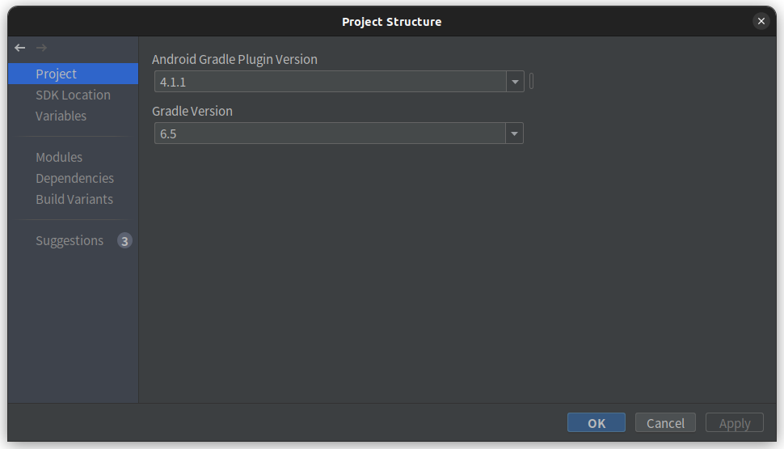
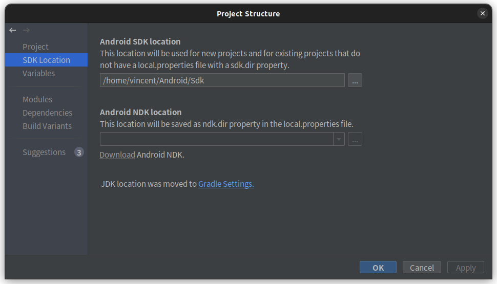
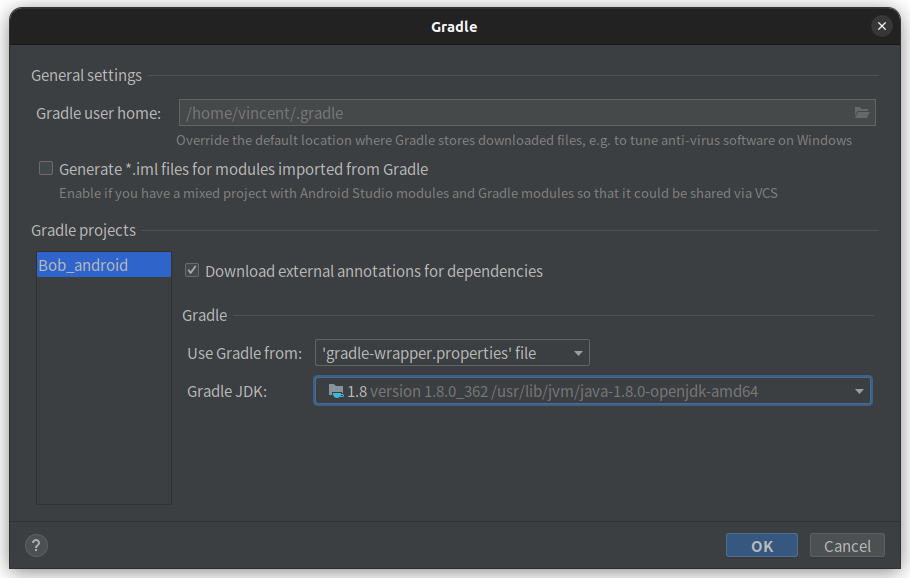

# Bob

機器人Python程式在 [nfu-irs-lab/Bob-python](https://github.com/nfu-irs-lab/Bob-python)，注意python程式的版本需與Android程式相對應，不可混用，造成錯誤。以下為此Android版本所使用的Python程式版本。

[Bob-python v1.0.0](https://github.com/nfu-irs-lab/Bob-python/releases/tag/v1.0.0)

複製v1.0.0版本程式

```shell
git clone https://[Token]@github.com/[User name]/Bob-python.git -b v1.0.0
```


## 環境

### 安裝 JDK 1.8 (JAVA 8)

Windows安裝檔：

https://www.oracle.com/tw/java/technologies/javase/javase8-archive-downloads.html

或是如果是Linux，終端機輸入

```shell
sudo apt-get install openjdk-8-jdk
```

1. 開啟Android Studio
2. 點選File -> Project Structure
3. 點選Project，將**Gradle Version**設定為**6.5**
4. 點選SDK Location，點選下方Gradle Setting
5. 將Gradle JDK設為**jdk 1.8**








## 參考
- https://github.com/koral--/android-gif-drawable
- https://developer.android.com/guide/topics/connectivity/bluetooth.html
- https://xnfood.com.tw/activity-life-cycle/
- https://developer.android.com/guide/components/activities/activity-lifecycle
- https://developer.android.com/guide/components/fragments
- https://developer.android.com/guide/components/services
- https://www.tutorialspoint.com/android/android_text_to_speech.htm
- https://medium.com/verybuy-dev/android-%E8%A3%A1%E7%9A%84%E7%B4%84%E6%9D%9F%E6%80%96%E5%B1%80-constraintlayout-6225227945ab
- https://materialdesignicons.com/
- https://ithelp.ithome.com.tw/articles/10189264
- https://developer.android.com/guide/topics/ui/declaring-layout?hl=zh-tw
- https://ithelp.ithome.com.tw/articles/10200466
- https://developer.android.com/reference/android/app/Activity
- https://developer.android.com/guide/fragments
- https://www.ruyut.com/2018/12/android-studio-button-onclick.html
- https://ithelp.ithome.com.tw/articles/10247448
- https://atceiling.blogspot.com/2021/06/android14ui-imageview-imagebutton.html

